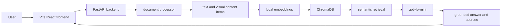

# InsightLens

Multimodal RAG for Intelligent Document Exploration

## Overview

InsightLens is a course-project multimodal retrieval-augmented generation app. Users upload PDFs, DOCX files, and images, then ask questions grounded only in retrieved textual and visual evidence from the current backend session.

## Main Features

- Upload PDF, DOCX, PNG, JPG, JPEG, BMP, TIF, and TIFF files.
- Extract PDF text page by page and DOCX paragraph text.
- Describe standalone images, embedded DOCX images, and rendered PDF pages with `gpt-4o-mini`.
- Index text and visual descriptions with local Hugging Face embeddings and ChromaDB.
- Ask grounded questions and inspect sources with filename, page, evidence type, snippet, and retrieval score.
- Delete individual documents or clear the full session.
- Use a Vite React frontend with landing and assistant routes.

## Architecture



## Technology Stack

- Frontend: Vite, React, TypeScript, Tailwind CSS, React Router, Lucide React, react-markdown, Sonner
- Backend: Python, FastAPI, Pydantic
- Document processing: PyPDF2, python-docx, pdf2image, Pillow
- RAG: LlamaIndex core chunking, ChromaDB, `BAAI/bge-small-en-v1.5` local embeddings
- Hosted AI: OpenAI Responses API with `gpt-4o-mini`

## Prerequisites

- Python 3.10+
- Node.js 20+
- An OpenAI API key
- Poppler for PDF page rendering when visual PDF analysis is needed

## Backend Installation

```bash
python -m venv .venv
.venv\Scripts\activate
python -m pip install -r requirements.txt
```

## Vite Frontend Installation

```bash
cd frontend
npm install
```

## OpenAI API Key Setup

Create a root `.env` file from `.env.example` and set:

```bash
OPENAI_API_KEY=your_key_here
OPENAI_MODEL=gpt-4o-mini
OPENAI_IMAGE_DETAIL=high
```

Never commit `.env` or real API keys.

## Optional Poppler Setup

PDF text extraction works without Poppler, but visual analysis of PDF pages requires it. Set `POPPLER_PATH` if Poppler is not on your system path.

Windows example:

```bash
POPPLER_PATH=C:\path\to\poppler\Library\bin
```

## Environment Variables

Root backend `.env`:

```bash
OPENAI_API_KEY=
OPENAI_MODEL=gpt-4o-mini
OPENAI_IMAGE_DETAIL=high
BACKEND_HOST=0.0.0.0
BACKEND_PORT=8000
FRONTEND_ORIGIN=http://localhost:5173
POPPLER_PATH=
MAX_UPLOAD_MB=20
MAX_VISUAL_PDF_PAGES=20
MAX_FILENAME_CHARS=120
MAX_ACTIVE_DOCUMENTS=25
CHUNK_SIZE=1000
CHUNK_OVERLAP=200
TOP_K_RESULTS=5
VISUAL_DESCRIPTION_MAX_TOKENS=900
```

Frontend `frontend/.env`:

```bash
VITE_API_BASE_URL=http://localhost:8000
```

## Running Backend and Frontend

Terminal 1, from the repository root:

```bash
python -m uvicorn backend.main:app --host 0.0.0.0 --port 8000 --reload
```

The project also includes Windows command launchers in the repository root:

```bash
run_backend.cmd
run_frontend.cmd
```

Terminal 2, from the repository root:

```bash
cd frontend
npm run dev
```

Open `http://localhost:5173`.

On this machine, the tested Python 3.12.7 interpreter is:

```bash
C:\Users\Walid\anaconda3\python.exe -m uvicorn backend.main:app --host 0.0.0.0 --port 8000 --reload
```

If another local service already uses port `8000`, start the backend on another port and update `frontend/.env.local`:

```bash
C:\Users\Walid\anaconda3\python.exe -m uvicorn backend.main:app --host 127.0.0.1 --port 8001
```

```bash
VITE_API_BASE_URL=http://127.0.0.1:8001
```

After changing a Vite `.env` file, restart `npm run dev`.

## API Endpoints

- `GET /health`
- `POST /upload`
- `GET /documents`
- `POST /ask`
- `DELETE /documents/{document_id}`
- `DELETE /documents`

## Example Usage

1. Start the backend and frontend.
2. Open the assistant workspace.
3. Upload a PDF, DOCX, or image.
4. Ask: `What are the main findings?`
5. Expand source cards to inspect retrieved evidence.

## Team

Edit `frontend/src/data/team.ts` before submission with final names and roles.

## Security

`.env` files are ignored by git and must never be committed. The frontend only uses `VITE_API_BASE_URL`; backend secrets remain server-side.

## Cost-Control Choices

- Uses `gpt-4o-mini` by default.
- Uses high image detail by default for better chart, figure, and table readability.
- Limits visual PDF analysis with `MAX_VISUAL_PDF_PAGES`.
- Sends only retrieved snippets, not full documents, when answering.
- Keeps embeddings local and free.

## Known Limitations

- Documents are session-scoped and are cleared when the backend restarts.
- OCR-style extraction is handled through OpenAI vision analysis for images and rendered PDF pages, not a separate offline OCR engine.
- Visual PDF analysis is capped by `MAX_VISUAL_PDF_PAGES`.
- The first local embedding-model download may take additional time.

## Demonstration Checklist

- Upload one PDF and confirm page-aware text sources.
- Upload one image and ask about visual content.
- Ask a question that is not answered by the uploaded content.
- Delete a document and verify its evidence is gone.
- Clear all documents and verify asking is blocked.
